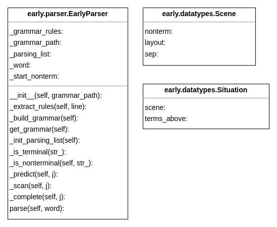

### Алгоритм Эрли

Реализация алгоритма Эрли разбора КС-грамматик.

#### Описание
Класс `EarlyParser` принимает на вход путь к `.txt` файлу с описанием грамматики
в формате **BNF**.  

* Метод `.parse()` экземпляра класса принимает на вход слово в формате последовательности элементов
алфавита грамматики, **каждый в двойных кавычках**, в python-списке. Возвращает `true`, если слово выводится в заданной грамматике и `false` иначе.  
`.parse()` реализует запрос, поэтому для экземпляра класса доступно произвольное
количество вызовов метода, все они отработают корректно.

* `.get_grammar()` возвращает строку-грамматику класса в формате BNF. 

#### Пример использования

```python
from early.parser import EarlyParser

parser = EarlyParser('tests/data/BNF_example.txt')

res = parser.parse(['"a"', '"b"'])  # equals to ab
```

#### Тестирование
Результаты тестов можно посмотреть через `github actions`, процент покрытия в
**отчете CI** в комментариях к последнему коммиту.

#### UML

